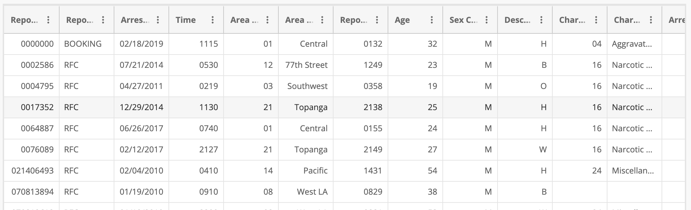
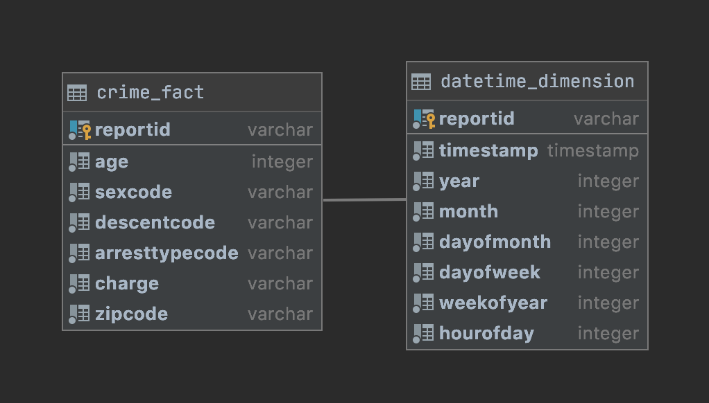
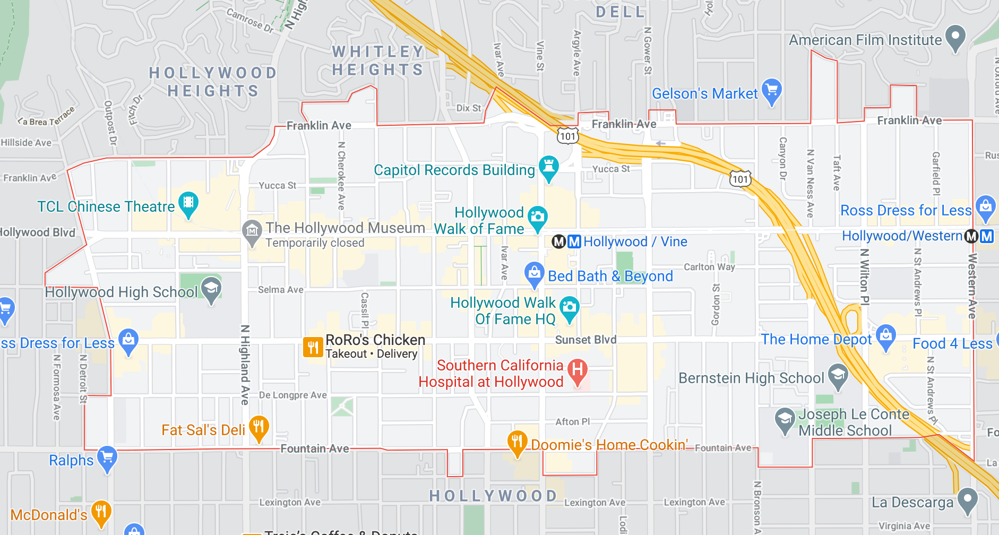
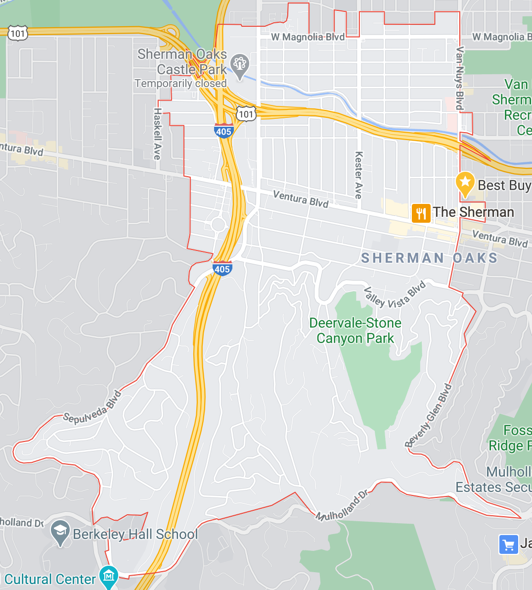

# dend-capstone
Udacity Data Engineering Nano Degree capstone project

## Goal
The goal of this project is to provide a star schema for analyzing Los Angeles crime reports.

## Data sources
The analytics data is derived from two data sources:
* [Los Angeles crime reports](https://data.lacity.org/A-Safe-City/Arrest-Data-from-2010-to-2019/yru6-6re4) - 1.3M rows
* [Los Angeles Postal Codes](https://data.lacounty.gov/Geospatial/ZIP-Codes/65v5-jw9f) - 311 zipcode shape records in [shapefile](https://en.wikipedia.org/wiki/Shapefile) format

## Exploring the data

A preview of the data is shown below.


A perusal of the data shows that there is arrest data with a variety
of interesting attributes, such as time, age, gender, enthnicity, and
charge codes.  What's missing from the data is additional geographic
information such as city and zip code.  This lack of information
motivated the addition of zip code data, derived from a separate source.

## Executing the pipeline
The pipeline downloads the data, loads it into postgres, and
transforms it into fact and dimension tables.  To execute the
pipeline, simply run the [run-pipeline.sh](https://github.com/ericmelz/dend-capstone/blob/main/scripts/pipeline/run_pipeline.sh) script:
```
scripts/pipeline/run_pipeline.sh
```
Details of the pipeline's ETL are described in a later section.


## Executing the quality checks
The quality checks are run at the end of the pipeline.
The quality check code is in the [quality_checks.py](https://github.com/ericmelz/dend-capstone/blob/main/python/quality_checks/quality_checks.py) file, and can be executed as follows:
```
cd scripts/quality_checks
pip3 install -r requirements.txt
python3 quality_checks.py
```
The quality checks performs 3 checks:
* Check that the crime fact table has rows
* Check that the time dimension table has rows
* Check that all arrestee sex codes are either 'M' or 'F'

## Executing the unit tests
The Unit tests use a separate database along with prepackaged .csv and
shape files.  The unit tests first load a .csv file with 9 rows of
data, then another csv file with the original 9 rows plus an
additional 10 rows.  The script checks that each run of the pipeline
generates the expected number of rows in the fact table (first 9, then
19).  To run the unit test execute
[scripts/unittest/run_unittest_pipeline.sh](https://github.com/ericmelz/dend-capstone/blob/main/scripts/unittest/run_unittest_pipeline.sh):
```
scripts/unittest/run_unittest.sh
```

## Data Model
The data model chosen was a star schema, using a relational database.
This data model is the most appropriate for the analytics use case.
For example, we can ask queries such, as

* What time of day are crimes most likely to occur?
* What zipcodes have the most crime?
* For a given zipcode, what are the most prevalent crimes?
* Have crimes trended up or down over time?
* What crimes are associated with each ethnicity?

The Data Model is shown below



## Data dictionary
### crime_fact - Fact table of arrest reports
| Column name | Type | Constraint | Description |
| --- | --- | --- | --- |
| ReportId | varchar | Primary Key | Id of the arrest report |
| Age | varchar | | Age of the offender |
| SexCode | varchar | | Gender of the offender M=Male, F=Female |
| Descent Code | varchar | | Ethnicity of the offender W=White, H=Hispanic, B=Black |
| Charge | varchar | | Penal code associated with the arrest |
| ZipCode | varchar | | Zip code of the arrest |

### datetime_dimension - Dimension table for date and time
| Column name | Type | Constraint | Description |
| --- | --- | --- | --- |
| ReportId | varchar | Primary Key | Id of the arrest report |
| Timestamp | timestamp |  | timestamp of the arrest |
| Year | integer |  | Year of the arrest |
| Month | integer |  | Year of the arrest |
| DayOfMonth | integer |  | Day of month  of the arrest |
| DayOfWeek | integer |  | Day of week of the arrest |
| WeekOfYear | integer |  | Week of year of the arrest |
| HourOfDay | integer |  | Hour of day of the arrest |

## 

## Example queries
### Top zipcodes for crime
```
SELECT zipcode, count(*) crimes
FROM crime_fact
GROUP BY zipcode
ORDER BY crimes DESC
LIMIT 5;

 zipcode | crimes
---------+--------
 90028   |  77526
 90291   |  59601
 90003   |  46616
 90013   |  38535
 90021   |  34204
```


### Top penal codes in Los Angeles (all zipcodes)


```
SELECT charge, count(*) counts, description
FROM crime_fact
JOIN penal_codes
ON crime_fact.charge = penal_codes.code
GROUP BY charge, description
ORDER BY counts DESC
LIMIT 5;

   charge   | counts |                        description                         
------------+--------+------------------------------------------------------------
 23152(A)VC |  98726 | driving under the influence of alchohol
 41.27CLAMC |  93842 | drinking alcohol in public
 273.5(A)PC |  46646 | domestic abuse
 11377(A)HS |  40931 | posession of methamphetamine
 11350(A)HS |  34221 | posession of a controlled substance without a prescription
```


### Top penal codes in Hollywood, (zipcode = 90028), the highest crime zipcode
```
SELECT charge, count(*) counts
FROM crime_fact
WHERE zipcode = '90028'
GROUP BY charge
ORDER BY counts DESC
LIMIT 5;

   charge   | counts |                    description                     
------------+--------+----------------------------------------------------
 41.27CLAMC |   9386 | drinking alcohol in public
 23152(A)VC |   4446 | driving under the influence of alchohol
 41.18DLAMC |   3954 | sitting or lying, or sleeping on a public sidewalk
 853.7PC    |   3646 | violation of a promise to appear in court
 25620(A)BP |   3442 | posession of an open alcohol container in public
```




### Top penal codes in Sherman Oaks (zipcode = 91403), a typical suburb
```
SELECT charge, count(*) counts, description
FROM crime_fact
JOIN penal_codes
ON crime_fact.charge = penal_codes.code
WHERE zipcode = '91403'
GROUP BY charge, description
ORDER BY counts DESC
LIMIT 5;

   charge   | counts |                        description                         
------------+--------+------------------------------------------------------------
 23152(A)VC |   2144 | driving under the influence of alchohol
 25620BP    |    195 | posession of an open alcohol container in public
 273.5(A)PC |    153 | domestic abuse
 11377(A)HS |    147 | posession of methamphetamine
 11350(A)HS |    135 | posession of a controlled substance without a prescription
```



### Most popular hours of the day to commit crimes
```
SELECT HourOfDay, count(*) crimes
FROM crime_fact
LEFT JOIN datetime_dimension
ON crime_fact.ReportId = datetime_dimension.ReportId
GROUP BY HourOfDay
ORDER BY crimes DESC
LIMIT 5;

 hourofday | crimes
-----------+--------
        16 |  80313
        17 |  78055
        15 |  77676
        18 |  77063
        20 |  76563
```

## Tools and technologies
The backend database used is
[PostgreSQL](https://www.postgresql.org/), with the
[PostGIS](https://postgis.net/) extension for spatial queries.

These technologies were chosen because they are easy to set up on any
machine, and they can handle the data size for this project.

The database and pipeline was set up on an AWS EC2 m5.2xlarge
instance with 1TB of storage. 

The pipeline is written using a combination of Bash, SQL, and Python.

## Pipeline

### Initial setup
After PostgreSQL and PostGIS are installed, the database needs to be
initialized.  From the project directory, execute
```
cd scripts
./initialize_database.sh
./initialize_unittest_database.sh
```
These steps create the unittest database, which contain the same
tables as the production tables, used for a testing environment.
Additionally, the PostGIS extension is registered with PostgreSQL. 

### Periodic data updates
To run the pipeline, execute from the project directory
```
scripts/run_pipeline.sh
```
This script does the following.

* *Download data* - Uses `curl` to download the arrest data (a `.csv` file) and the zipcode
shapes (a `.zip` file containing shape files).

* *Convert shapes* - runs `shp2pgsql` to convert the shape data into
   valid SQL, and loads the SQL into the `zip_codes` table.  Then a
   saptial index is created on the zip_codes table.

* *Setup fact and dimension tables* - If the fact and dimension tables
   don't already exist, create them

* *Load raw arrest data* - Use the PostgreSQL `COPY` command to load
   the raw csv into the `crime_staging_untyped` table,  mirroring the
   csv structure.  All colummns in `crime_staging_untyped`
   are varchars.

* *Clean the raw data* - Change rows containing `time=2400` to
   `time=0000`, and remove rows containing `NULL`s

* *Compute new records* - Calculate the records that are not already
   in the fact table.  Store the ids of the new records.

* *Strongly type staging data* - Cast columns of
   `crime_staging_untyped` to their appropriate types.  Store result
   in `crime_staging_typed`.  Also, create a spatial column for the
   location of the arrest report, and index the spatial column.

* *Join zipcodes* - Geographically join `crime_staging_typed` with
   `zip_codes` to decorate arrest reports with zipcodes.  Save the
   result in `crime_staging_typed_with_zips`

* *Drop duplicates* - Since their can be multiple zipcodes that
   intersect a given point, drop all but the lowest-numbered zipcode
   for each arrest report.

* *Load fact table* - Load the processed records from
   `crime_staging_typed_with_zips` to the `crime_fact` table.

* *Load dimension table* - Create the `datetime_dimension` table based
   on timestamps available in `crime_staging_typed`.


## Quality assurance
Several quality constraints are built in to the pipeline.  These
include:
* Primary key constraints on the fact and dimension tables
* Non-nullable constraints on the staging table
* Dropping of duplicates during computation of the fact table
* Changing the bad `2400` time to `0000`, representing midnight
* Dropping of rows that contain `NULL` values.


## Scheduling
The pipeline should be run weekly.  This is because the source arrest
data is updated weekly.

## Scaling
### Data Increase
If the data were to increase by 100x, it would no longer be feasible
to use the identical pipeline and database.  This is because the
pipeline takes about 15 minutes to run currently, and a 100x increase
in size necessitates approximately 100x time to process, in this
case over one day.  To mitigate the increased demand, the data can be
partitioned into time-based chunks such as daily or hourly.  This
would allow a spark-based pipeline to process each partition in
parallel.  Also a datawarehouse such as Redshift can leverage
distributed nodes to speed up processing.

The pipeline could be further productionalized by leveraging airflow,
enabling monitoring and backfilling functionality.

### Daily schedule
If the pipeline were to run at 7a.m., Airflow or a cron job could be
scheduled to run the `run_pipeline.sh` script daily at 7a.m.
Otherwise, there is little to change about the pipeline.  This is
because the pipeline is design to detect new records, and will process
only the new records when they become available.  If there are no new
records in the source data, there will be nothing added to the fact or
dimension tables.  Currently, the pipeline takes about 15 minutes to
run, so there would be a minor cost incurred for running it daily.

### Data access
If the data needed to be accessed by 100+ people, the current
PostgreSQL database should be able to handle it.  However, for the
most robust system, a distributed datawarehouse such as Redshift or
Snowflake should be used in place of PostgreSQL.

Additionally, a log of user activity should be maintained, and the
load on the cluster should be monitored.  If additional resources are
needed, additional cluster nodes should be allocated.
